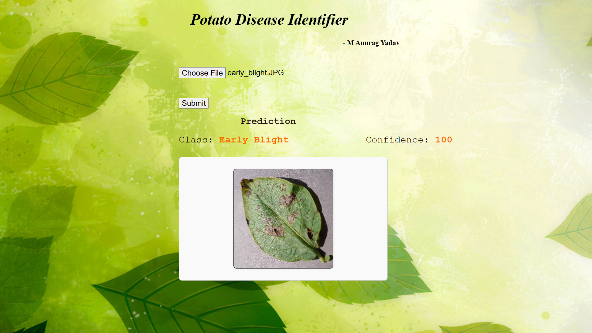

# Potato Disease Predictor

A Flask web application for classifying potato leaf images into disease categories (Early Blight, Late Blight, or Healthy) using a pre-trained TensorFlow Keras model.

---

## Table of Contents

- [Features](#features)
- [Project Structure](#project-structure)
- [Requirements](#requirements)
- [Installation](#installation)
- [Usage](#usage)
  - [Running Locally](#running-locally)
  - [API Endpoints](#api-endpoints)
- [Demo](#demo)
- [Model Details](#model-details)
- [Contributing](#contributing)
- [License](#license)

---

## Features

- **Image Classification**: Detects Early Blight, Late Blight, or Healthy potato leaves.  
- **REST API**: Provides endpoints for health checks and predictions.  
- **Web Interface**: Simple HTML form for uploading images and viewing results.

---

## Project Structure

```

potato-disease-predictor-master/
├── app.py                # Main Flask application
├── requirements.txt      # Python dependencies
├── savedmodels/1/        # SavedModel directory for the Keras model
├── static/               # Static assets (CSS, JS, images)
├── templates/            # HTML templates (index.html)
├── screenshots/          # Demo screenshots referenced in this README
├── Training/             # Jupyter notebooks and training scripts
├── potatoes.h5           # (Optional) Keras HDF5 format model
└── README.md             # Project documentation (this file)

````

---

## Requirements

- Python 3.9–3.12  
- Conda (optional but recommended) or pip  

Key libraries (see `requirements.txt`):
```txt
flask
numpy
pillow
tensorflow
````

---

## Installation

1. **Clone the repository**:

   ```bash
   git clone https://github.com/<your-username>/potato-disease-predictor-master.git
   cd potato-disease-predictor-master
   ```

2. **Initialize Conda for your shell** (if not already):

   ```bash
   conda init bash        # or powershell, zsh, etc.
   exec $SHELL            # restart shell session
   ```

3. **Create and activate the Conda environment** (recommended):

   ```bash
   conda create -n tf python=3.10 -y
   conda activate tf
   ```

4. **Install Python dependencies**:

   ```bash
   python -m pip install --upgrade pip setuptools wheel
   pip install -r requirements.txt
   ```

5. **Install Flask if missing** (should already be in `requirements.txt`, but verify):

   ```bash
   pip install flask
   ```

---

## Usage

### Running Locally

1. **Set the Flask app entrypoint** (optional):

   ```bash
   export FLASK_APP=app.py      # Linux/macOS
   set FLASK_APP=app.py         # Windows CMD
   $Env:FLASK_APP = 'app.py'    # Windows PowerShell
   ```

2. **Start the server**:

   ```bash
   flask run --host=0.0.0.0 --port=5000
   # or simply:
   python app.py
   ```

3. **Open your browser** to:

   ```
   http://127.0.0.1:5000/
   ```

4. **Upload** a potato leaf image and click **Submit** to see predictions.

### API Endpoints

* **Health Check**:

  ```bash
  curl http://127.0.0.1:5000/ping
  # => "Hello, I am alive"
  ```

* **Prediction**:

  ```bash
  curl -X POST -F file=@path/to/leaf.jpg http://127.0.0.1:5000/predict
  ```

  **Response** (JSON):

  ```json
  {
    "class": "Early Blight",
    "confidence": 0.92,
    "image": "<base64-encoded image>"
  }
  ```

---

## Demo

Place four screenshots in `screenshots/` with the **exact** filenames below:

```
screenshots/
├── home.png      # the main upload page before submitting an image
├── early.png     # after submitting an Early Blight leaf
├── healthy.png   # after submitting a Healthy leaf
└── late.png      # after submitting a Late Blight leaf
```

Your project tree should include:

```
potato-disease-predictor-master/
├── screenshots/
│   ├── home.png
│   ├── early.png
│   ├── healthy.png
│   └── late.png
└── ...           # rest of your files
```

Then use this markdown to display them:

| Home Page                          | Early Blight Prediction                |
| ---------------------------------- | -------------------------------------- |
|  |  |

| Healthy Prediction                  | Late Blight Prediction               |
| ----------------------------------- | ------------------------------------ |
|  |  |

---

## Model Details

* **Framework**: TensorFlow Keras
* **Input**: 256×256×3 RGB images normalized to \[0,1]
* **Architecture**: Convolutional Neural Network (Conv2D + MaxPooling + Dense layers)
* **Classes**: `['Early Blight', 'Late Blight', 'Healthy']`
* **SavedModel**: directory `savedmodels/1` contains the TensorFlow SavedModel.

---

## Contributing

Contributions are welcome! Please open an issue or submit a pull request:

1. Fork the repository
2. Create a feature branch:

   ```bash
   git checkout -b feature/YourFeature
   ```
3. Commit your changes:

   ```bash
   git commit -m "Add new feature"
   ```
4. Push and open a PR:

   ```bash
   git push origin feature/YourFeature
   ```

---

## License

This project is licensed under the MIT License. See [LICENSE](LICENSE) for details.

```
::contentReference[oaicite:0]{index=0}
```
